# 🏡 Tu Portal Inmobiliario

## Descripción

**Tu Portal Inmobiliario** es un sistema CRUD desarrollado para la gestión de propiedades inmobiliarias. Permite a los usuarios agregar, visualizar, actualizar y eliminar propiedades a través de una interfaz web intuitiva y amigable. Este sistema se construyó con un frontend en HTML, CSS y JavaScript, un backend en Spring Boot, y una base de datos MySQL, con despliegue en AWS.

---

## 📍 Comenzando

Estas instrucciones te permitirán obtener una copia del proyecto en funcionamiento en tu máquina local para propósitos de desarrollo y pruebas.

### 🔧 Prerrequisitos

Debes instalar los siguientes componentes:

- [Java JDK 8 o superior](https://www.oracle.com/java/technologies/javase-jdk11-downloads.html)
- [Maven](https://maven.apache.org/download.cgi)
- [Git](https://git-scm.com/)
- [MySQL](https://dev.mysql.com/downloads/installer/)
- [DBeaver](https://dbeaver.io/download/)
- Un navegador Web
- Utiliza el entorno de desarrollo integrado (IDE) de tu preferencia, como por ejemplo:
    - IntelliJ IDEA
    - Eclipse
    - Apache NetBeans

### ⚙️ Instalación

1. **Clona el repositorio:**
   ```sh
   git clone https://github.com/saraygonm/CRUD-AREP.git
   ```

2. **Entra en la carpeta del proyecto:**
   ```sh
   cd CRUD-AREP
   ```

3. **Compila el proyecto con Maven:**
   ```sh
   mvn clean package
   ```

4. **Inicia el servidor:**
   ```sh
   mvn spring-boot:run
   ```

5. **Accede a la aplicación en el navegador:**
   ```
   http://localhost:8080
   ```

* Una vez iniciado el servidor, podrás visualizar la página web en tu navegador.


<p align="center">

</p>

---

## ✅ Ejecutar las pruebas

Para ejecutar las pruebas automáticas, el servidor debe estar en ejecución:

```sh
mvn clean test
```

<!-- Imagen de ejemplo -->
|  |
|--------------------------------------------------------------------------------------------|
| **Imagen 1: Pruebas exitosas**                                                             |

Las pruebas incluyen validaciones de:
- ClientTest: Pruebas de integración con la API.
- ControllerAppTest: Verifica la configuración del controlador principal.
- PropertyControllerTests: Pruebas CRUD para PropertyController.
- PropertyTest: Verifica la entidad Property y su correcto funcionamiento.
---

## 🏢 Base de Datos

Se utiliza **MySQL** como sistema de gestión de bases de datos. La estructura de la tabla `properties` es la siguiente:

| Campo       | Tipo         | Descripción                     |
|------------|-------------|---------------------------------|
| id         | BIGINT      | Identificador único de la propiedad |
| address    | VARCHAR(255)| Dirección de la propiedad      |
| price      | DOUBLE      | Precio de la propiedad        |
| size       | INT         | Tamaño en metros cuadrados    |
| description| TEXT        | Descripción de la propiedad   |

La conexión con MySQL está configurada en el archivo `application.properties` dentro de `src/main/resources/`.

**Visualización DBEAVER**
<p align="center">

</p>

---

## 🏗️ Arquitectura

### 📌 Diagrama de Clases

<p align="center">

</p>

### 📌 Diagrama de Secuencia

<p align="center">

</p>

### 📌 Diagrama de Despliegue

<p align="center">

</p>

### 📌 Diagrama de Componentes

<p align="center">

</p>

---

## 🌐 Frontend

El sistema cuenta con una interfaz web desarrollada en **HTML, CSS y JavaScript**.

- **`index.html`**: Interfaz de usuario con formularios y listados de propiedades.
- **`style.css`**: Hoja de estilos para mejorar la apariencia visual.
- **`script.js`**: Lógica del cliente para la comunicación con la API REST.

---

## 🌐 Funcionalidad

### Agregar
<!-- Creación de tabla para alinear las imágenes lado a lado.-->
|  |  |
|---------------------------------------------------------------------------|--------------------------------------------------------------------------|
| **LLenamos los datos**                                                    | **Se agrega**                                                            |


### Actualizar 
<!-- Creación de tabla para alinear las imágenes lado a lado.-->
|  |  |  |
|------------------------------------------------------------------------------|------------------------------------------------------------------------------|----------------------------------------------------------------------|
| **Actualizar agregando el # y 79m2**                                         | **Actualizada**                                                              | **Base de datos**                                                    |

### Borrar
<!-- Creación de tabla para alinear las imágenes lado a lado.-->
<!-- Creación de tabla para alinear las imágenes lado a lado.-->
|  |  |  |
|----------------------------------------------------------------------------|----------------------------------------------------------------------------|----------------------------------------------------------------------|
| **Eliminamos la propiedad apartamento**                                    | **Eliminada**                                                              | **Base de datos**                                                    |


# 🚀 Despliegue en AWS

Para el despliegue en AWS, se siguen los siguientes pasos:

1. **Configurar una instancia EC2** con acceso a MySQL.
2. **Configurar una base de datos en RDS** con MySQL.
3. **Construir y subir una imagen Docker** del backend.
4. **Ejecutar la aplicación** en un servidor Nginx o en una instancia EC2 con Docker.

---

## 📌 Despliegue de Base de Datos en AWS EC2 con Spring Boot

## Configuración de la Instancia EC2 para la Base de Datos SQL

<p align="center">
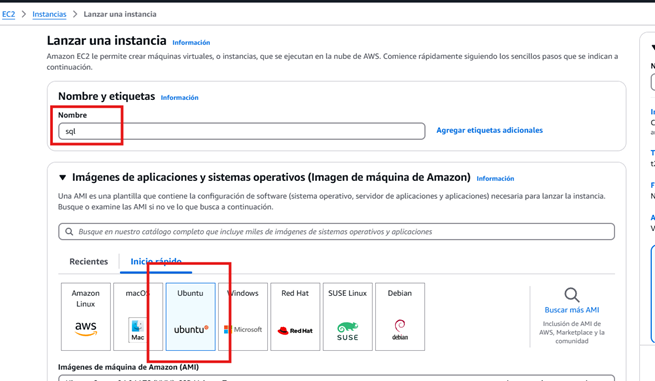
</p>

### Elegir o crear un par de llaves
Es importante generar o seleccionar un par de llaves para
acceder a la instancia EC2 de forma segura.

### Configuración de Red
Editar la configuración de red para agregar la regla de **MySQL/Aurora** y permitir acceso desde cualquier dispositivo.

<p align="center">
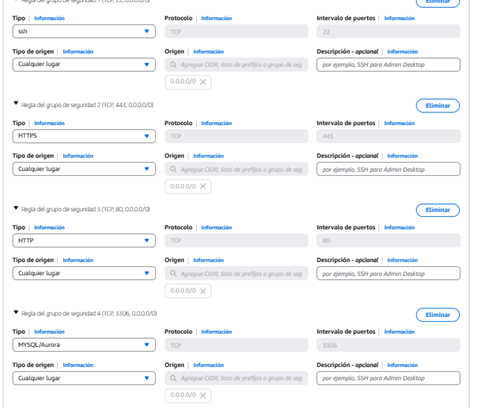
</p>

---

## Conexión a la Instancia EC2 desde la Terminal

### Asegurar que la clave tenga los permisos correctos:
```sh
icacls "C:\Users\aliet\Downloads\dios.pem" /inheritance:r
icacls "C:\Users\aliet\Downloads\dios.pem" /grant:r %username%:R
```

### Conectarse por SSH a la instancia de MySQL en AWS:
```sh
ssh -i "ubicacion de la clave.pem" ubuntu@dir_IP_Instancia
```
Ejemplo:
```sh
ssh -i "C:\Users\aliet\Downloads\dios.pem" ubuntu@54.208.7.131
```

---

## Instalación de MySQL en Ubuntu

Ejecutar los siguientes comandos en la terminal:

```sh
sudo apt update
sudo apt install mysql-server -y
sudo nano /etc/mysql/mysql.conf.d/mysqld.cnf
```

Buscar la línea:
```sh
bind-address = 127.0.0.1
```
Cambiarla por:
```sh
bind-address = 0.0.0.0
```

<p align="center">
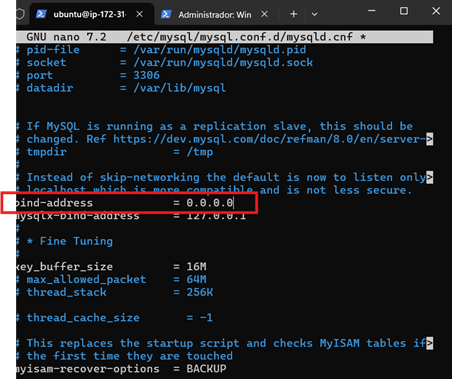
</p>

Guardar y salir (`CTRL + X`, `Y`, `Enter`).

Reiniciar MySQL:
```sh
sudo systemctl restart mysql
```

---

## Exportación de Base de Datos desde DBeaver


1. Abre **DBeaver** y conéctate a la base de datos local.
2. Clic derecho sobre la base de datos **properties_db** → Herramientas → **Dump Base de Datos**.
3. Tener marcadas las siguientes opciones en Export configuration
<p align="center">
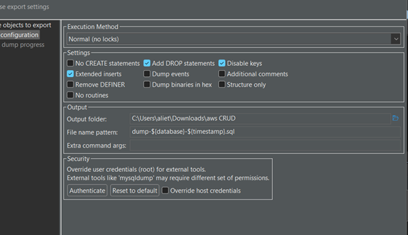
</p>

4. Configurar la exportación en formato **SQL (.sql)**.
4. Guardar el archivo en tu PC (`properties_db.sql`).

---

## Transferencia del Archivo SQL a la Instancia EC2

Desde la terminal del PC:

```sh
PS C:\Users\aliet> icacls "C:\Users\aliet\Downloads\dios.pem" /inheritance:r
PS C:\Users\aliet> icacls "C:\Users\aliet\Downloads\dios.pem" /grant:r aliet:F 
C:\Users\aliet> scp -i "C:\Users\aliet\Downloads\dios.pem" properties_db.sql ubuntu@54.208.7.131:/home/ubuntu/

```

Hacemos Conexión con la instancia:

```sh
 ssh -i "C:\Users\aliet\Downloads\dios.pem" ubuntu@54.208.7.131
```

Copiamos la base de datos
```sh
ubuntu@ip-172-31-18-15:~$ scp -i "C:\Users\aliet\Downloads\dios.pem" C:\Users\aliet\Downloads\aws CRUD\properties_db.sql ubuntu@54.208.7.131:/home/ubuntu/
```

Verificar que el archivo fue subido correctamente:
```sh
ls -lh /home/ubuntu/
```
<p align="center">
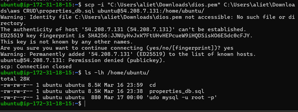
</p>

<p align="center">
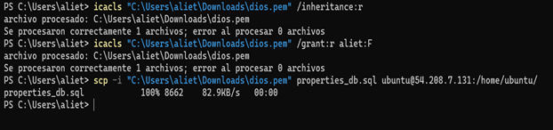
</p>

---

## Configuración de MySQL en AWS

verificamos que este corriendo el servidor

```sh
systemctl status mysql
```

<p align="center">
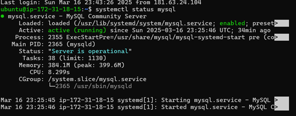
</p>

Conectarse a MySQL:
```sh
sudo mysql -u root -p
```
(Dejar en blanco si no se ha configurado una contraseña).

<p align="center">
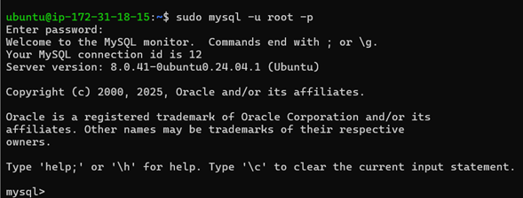
</p>

Crear un usuario con permisos remotos:
```sql
CREATE USER 'admin'@'%' IDENTIFIED BY 'TuContraseñaSegura';
GRANT ALL PRIVILEGES ON *.* TO 'admin'@'%' WITH GRANT OPTION;
FLUSH PRIVILEGES;
EXIT;
```

Conexión con URL:
```sh
jdbc:mysql://54.162.171.163:3306/properties_db?allowPublicKeyRetrieval=true&useSSL=false
```

<p align="center">
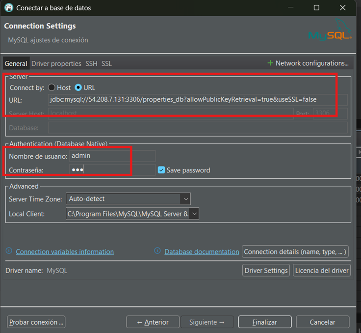
</p>

---

## Configuración del Backend para Conectarse a MySQL

<p align="center">
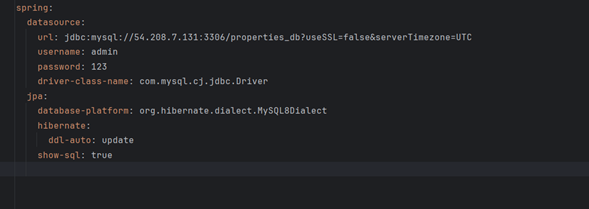
</p>

Modificar `application.properties`:

```properties
spring.datasource.url=jdbc:mysql://54.208.7.131:3306/properties_db?useSSL=false&serverTimezone=UTC
spring.datasource.username=admin
spring.datasource.password=123
```

---

## Despliegue de la Aplicación en EC2

Creación de la instancia 

<p align="center">
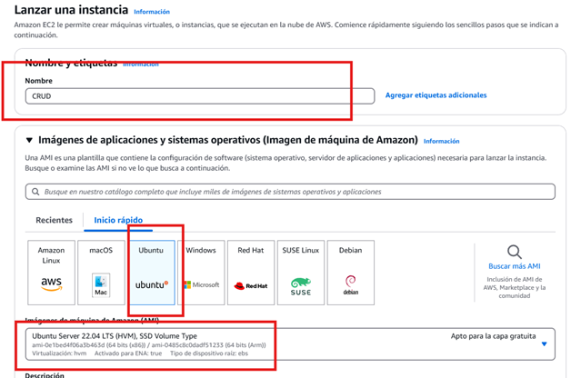
</p>

Mismo par de llaves que se uso con la instancia sql para facilitar gestiones 

<p align="center">
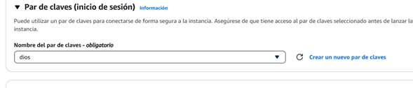
</p>

Configuración de red -- > editar --> agregar TCP puerto 8080 y origen 0.0.0.0
<p align="center">
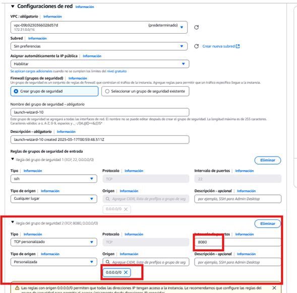
</p>

Conectar a la instancia:
```sh
ssh -i "C:\Users\aliet\Downloads\dios.pem" ubuntu@18.212.192.123
```

### Agregar al script.js 
```sh
const apiUrl="http://18.212.192.123:8080/properties";80 y origen 0.0.0.0

```
<p align="center">
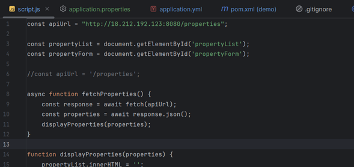
</p>

En la terminal del PC
```sh
ssh -i " C:\Users\aliet\Downloads\prueba cambio\CRUD-AREP\dios.pem" ubuntu@18.212.192.123
```

Instalar Java 17+:
```sh
sudo apt update
sudo apt install openjdk-17-jdk -y
java -version
```
<p align="center">
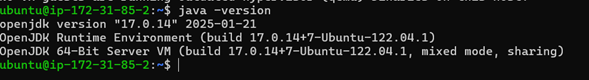
</p>


Generar el `.jar` en IntelliJ:
```sh
mvn clean package
```

Subir el `.jar` al servidor:
```sh
scp -i "C:\Users\aliet\Downloads\dios.pem" target/demo-0.0.1-SNAPSHOT.jar ubuntu@18.212.192.123:/home/ubuntu/
```

Ejecutar la aplicación:
```sh
java -jar /home/ubuntu/demo-0.0.1-SNAPSHOT.jar
```

---

### Configuración de Nginx en EC2 para Servir el Frontend

<p align="center">

</p>

### Conectarse al servidor:
```sh
ssh -i "dios.pem" ubuntu@18.212.192.123
```

### Instalar Nginx:
```sh
sudo apt update
sudo apt install nginx -y
```

### Mover archivos HTML a la carpeta de Nginx:
```sh
sudo mv /home/ubuntu/static /var/www/html/
```

### Cambiar permisos:
```sh
sudo chmod -R 755 /var/www/html/static
```

### Reiniciar Nginx:
```sh
sudo systemctl restart nginx
```

---


---
### 📺 Video de Demostración


En este video se muestra el despliegue de las instancias EC2, una para la base de datos SQL y otra para el backend denominado CRUD. Asimismo, se verifica el correcto funcionamiento de la página, los endpoints y la base de datos.
## 🛠️ Tecnologías Utilizadas

- **Java** - Lenguaje de programación principal
- **Spring Boot** - Framework backend
- **MySQL** - Base de datos relacional
- **JPA/Hibernate** - ORM para gestión de datos
- **Maven** - Gestor de dependencias
- **Docker** - Contenedorización
- **AWS** - Despliegue en la nube

---


## 👨🏼‍💻 Autora

**Saray Mendivelso** 

---


