# 🏡 Tu Portal Inmobiliario

## Descripción

**Tu Portal Inmobiliario** es un sistema CRUD desarrollado para la gestión de propiedades inmobiliarias. Permite a los usuarios agregar, visualizar, actualizar y eliminar propiedades a través de una interfaz web intuitiva y amigable. Este sistema se construyó con un frontend en HTML, CSS y JavaScript, un backend en Spring Boot, y una base de datos MySQL, con despliegue en AWS.

---

## 📍 Comenzando

Estas instrucciones te permitirán obtener una copia del proyecto en funcionamiento en tu máquina local para propósitos de desarrollo y pruebas.

### 🔧 Prerrequisitos

Debes instalar los siguientes componentes:

- [Java JDK 8 o superior](https://www.oracle.com/java/technologies/javase-jdk11-downloads.html)
- [Maven](https://maven.apache.org/download.cgi)
- [Git](https://git-scm.com/)
- [MySQL](https://dev.mysql.com/downloads/installer/)
- [DBeaver](https://dbeaver.io/download/)
- Un navegador Web
- Utiliza el entorno de desarrollo integrado (IDE) de tu preferencia, como por ejemplo:
    - IntelliJ IDEA
    - Eclipse
    - Apache NetBeans

### ⚙️ Instalación

1. **Clona el repositorio:**
   ```sh
   git clone https://github.com/saraygonm/CRUD-AREP.git
   ```

2. **Entra en la carpeta del proyecto:**
   ```sh
   cd CRUD-AREP
   ```

3. **Compila el proyecto con Maven:**
   ```sh
   mvn clean package
   ```

4. **Inicia el servidor:**
   ```sh
   mvn spring-boot:run
   ```

5. **Accede a la aplicación en el navegador:**
   ```
   http://localhost:8080
   ```

* Una vez iniciado el servidor, podrás visualizar la página web en tu navegador.


<p align="center">
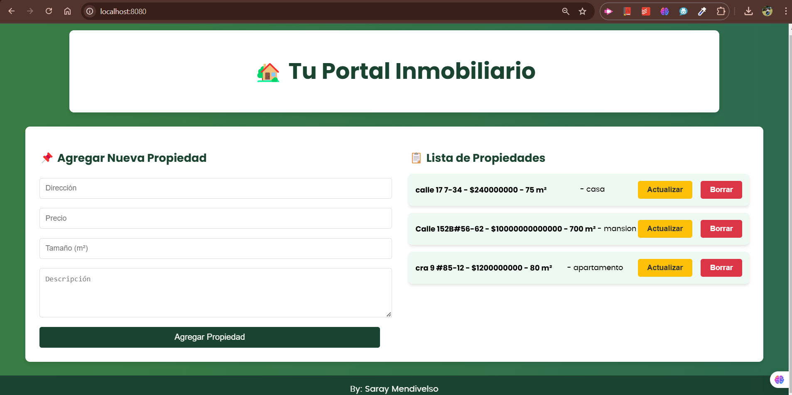
</p>

---

## ✅ Ejecutar las pruebas

Para ejecutar las pruebas automáticas, el servidor debe estar en ejecución:

```sh
mvn clean test
```

<!-- Imagen de ejemplo -->
| 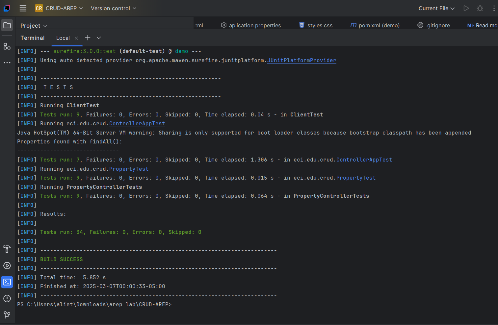 |
|--------------------------------------------------------------------------------------------|
| **Imagen 1: Pruebas exitosas**                                                             |

Las pruebas incluyen validaciones de:
- ClientTest: Pruebas de integración con la API.
- ControllerAppTest: Verifica la configuración del controlador principal.
- PropertyControllerTests: Pruebas CRUD para PropertyController.
- PropertyTest: Verifica la entidad Property y su correcto funcionamiento.
---

## 🏢 Base de Datos

Se utiliza **MySQL** como sistema de gestión de bases de datos. La estructura de la tabla `properties` es la siguiente:

| Campo       | Tipo         | Descripción                     |
|------------|-------------|---------------------------------|
| id         | BIGINT      | Identificador único de la propiedad |
| address    | VARCHAR(255)| Dirección de la propiedad      |
| price      | DOUBLE      | Precio de la propiedad        |
| size       | INT         | Tamaño en metros cuadrados    |
| description| TEXT        | Descripción de la propiedad   |

La conexión con MySQL está configurada en el archivo `application.properties` dentro de `src/main/resources/`.

**Visualización DBEAVER**
<p align="center">
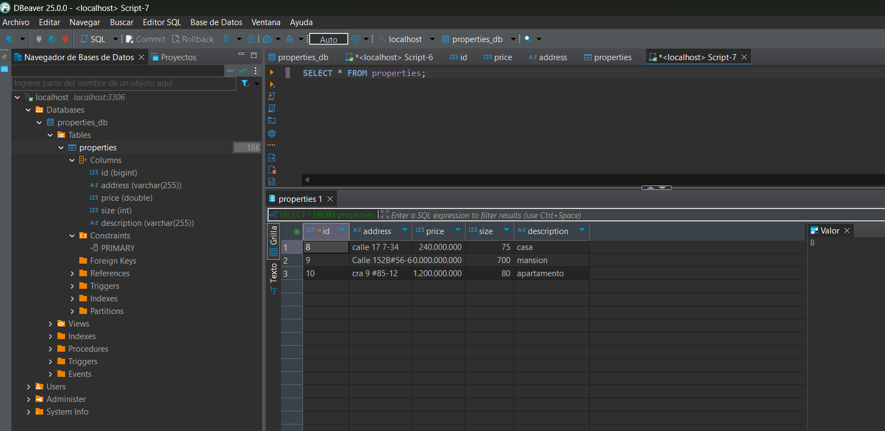
</p>

---

## 🏗️ Arquitectura

### 📌 Diagrama de Clases

<p align="center">
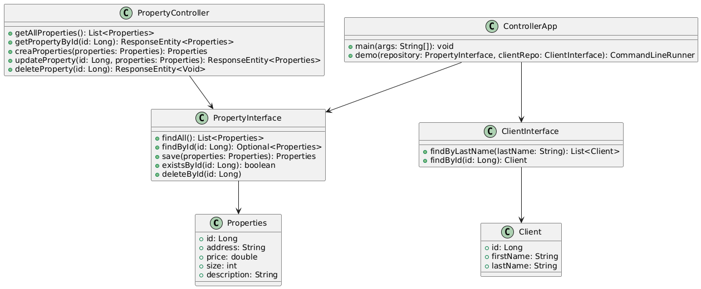
</p>

### 📌 Diagrama de Secuencia

<p align="center">
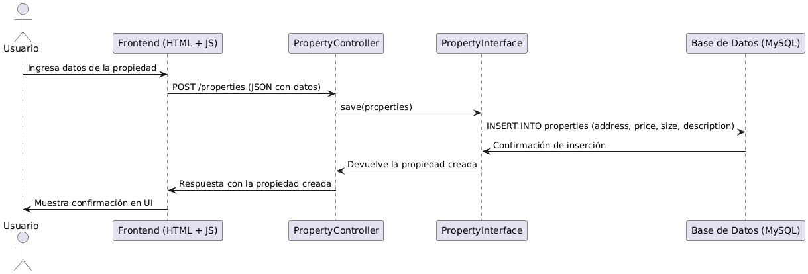
</p>

### 📌 Diagrama de Despliegue

<p align="center">
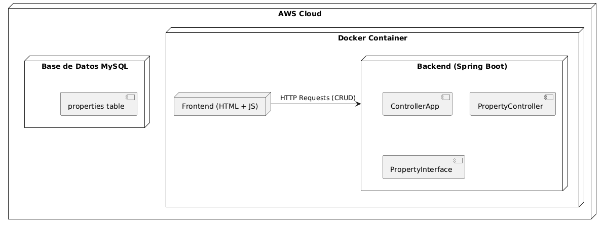
</p>

### 📌 Diagrama de Componentes

<p align="center">
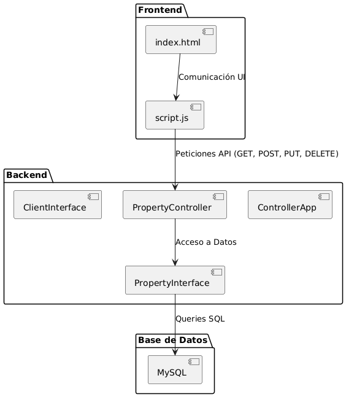
</p>

---

## 🌐 Frontend

El sistema cuenta con una interfaz web desarrollada en **HTML, CSS y JavaScript**.

- **`index.html`**: Interfaz de usuario con formularios y listados de propiedades.
- **`style.css`**: Hoja de estilos para mejorar la apariencia visual.
- **`script.js`**: Lógica del cliente para la comunicación con la API REST.

---

## 🌐 Funcionalidad

### Agregar
<!-- Creación de tabla para alinear las imágenes lado a lado.-->
| 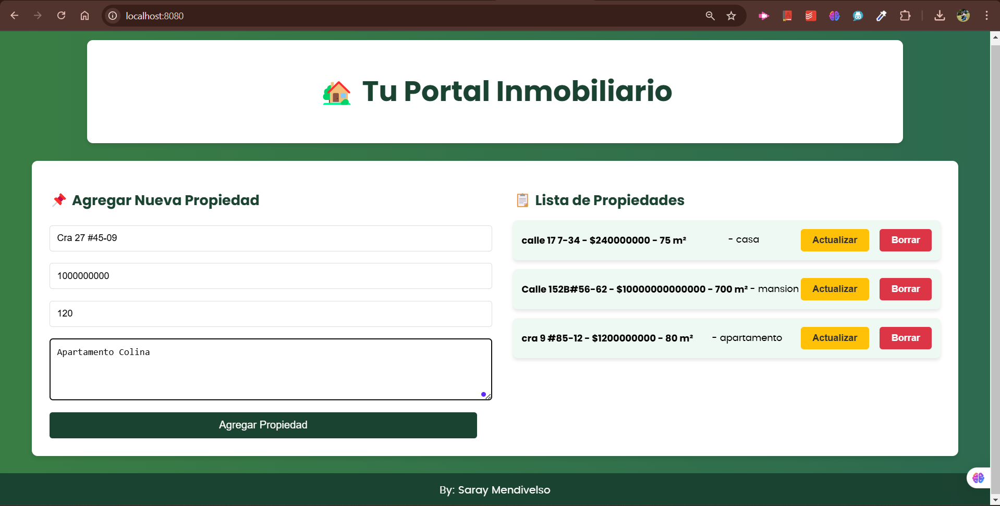 |  |
|---------------------------------------------------------------------------|--------------------------------------------------------------------------|
| **LLenamos los datos**                                                    | **Se agrega**                                                            |


### Actualizar 
<!-- Creación de tabla para alinear las imágenes lado a lado.-->
| 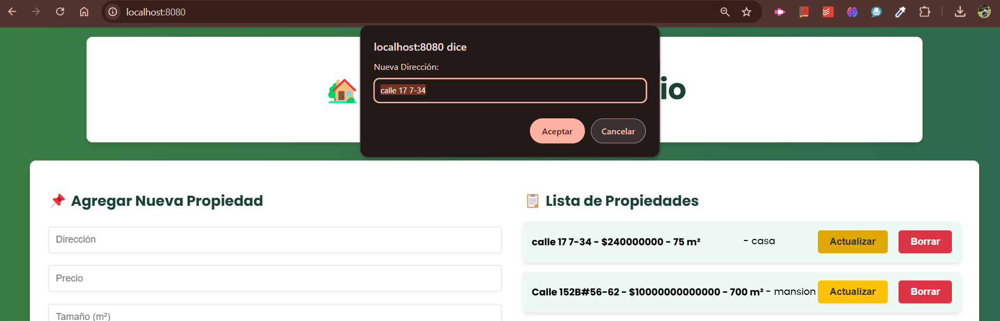 | 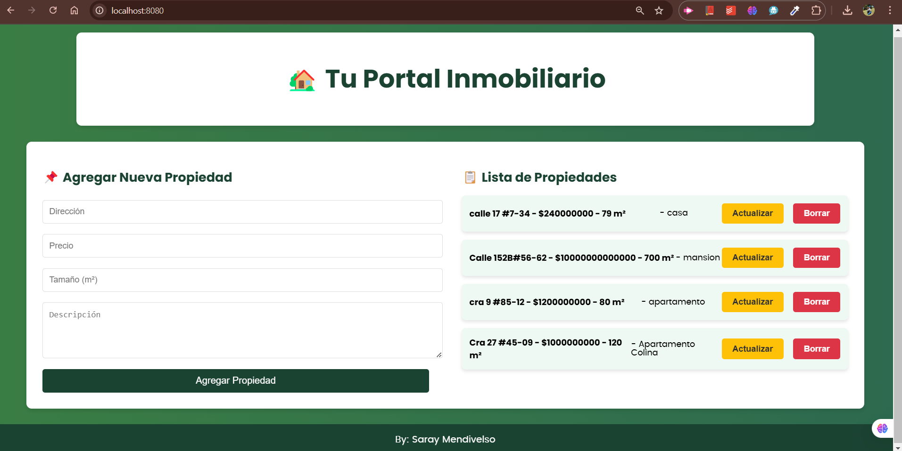 | 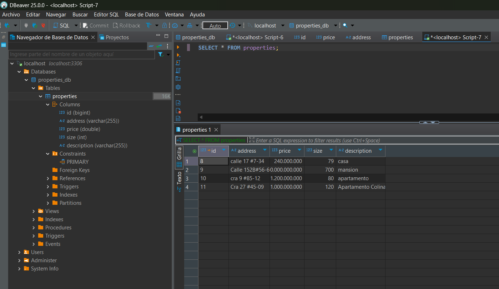 |
|------------------------------------------------------------------------------|------------------------------------------------------------------------------|----------------------------------------------------------------------|
| **Actualizar agregando el # y 79m2**                                         | **Actualizada**                                                              | **Base de datos**                                                    |

### Borrar
<!-- Creación de tabla para alinear las imágenes lado a lado.-->
<!-- Creación de tabla para alinear las imágenes lado a lado.-->
| 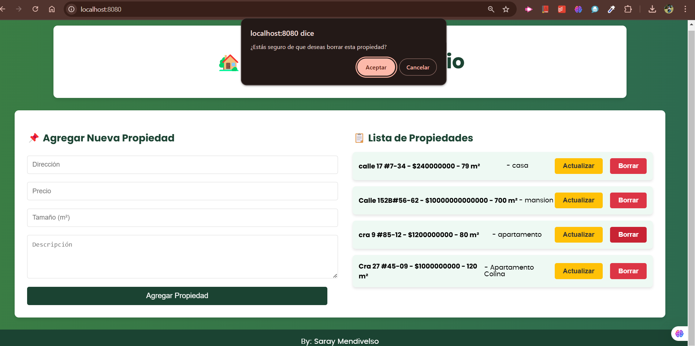 | 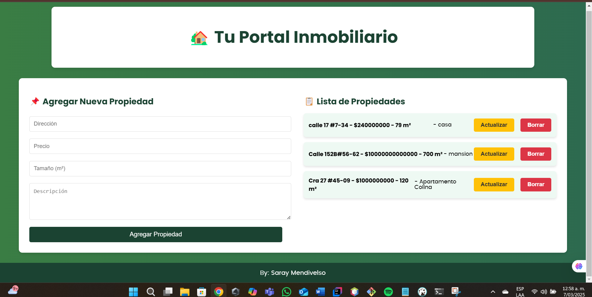 | 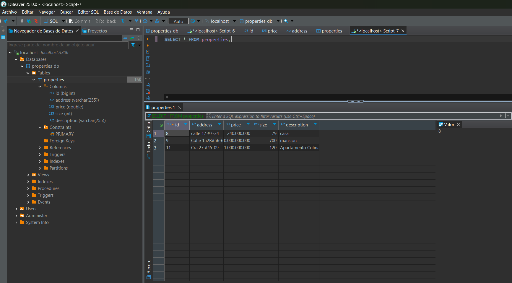 |
|----------------------------------------------------------------------------|----------------------------------------------------------------------------|----------------------------------------------------------------------|
| **Eliminamos la propiedad apartamento**                                    | **Eliminada**                                                              | **Base de datos**                                                    |


## 🚀 Despliegue en AWS

Para el despliegue en AWS, se siguen los siguientes pasos:

1. **Configurar una instancia EC2** con acceso a MySQL.
2. **Configurar una base de datos en RDS** con MySQL.
3. **Construir y subir una imagen Docker** del backend.
4. **Ejecutar la aplicación** en un servidor Nginx o en una instancia EC2 con Docker.

---

## 🛠️ Tecnologías Utilizadas

- **Java** - Lenguaje de programación principal
- **Spring Boot** - Framework backend
- **MySQL** - Base de datos relacional
- **JPA/Hibernate** - ORM para gestión de datos
- **Maven** - Gestor de dependencias
- **Docker** - Contenedorización
- **AWS** - Despliegue en la nube

---

## 👨🏼‍💻 Autora

**Saray Mendivelso** - Desarrollo inicial

---

### 📺 Video de Demostración

[](https://www.youtube.com/watch?v=VIDEO_ID_HERE)

En este video se muestran las operaciones CRUD en acción y el despliegue del sistema en AWS.

